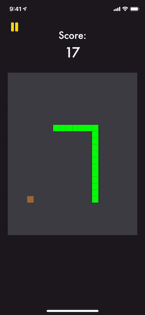
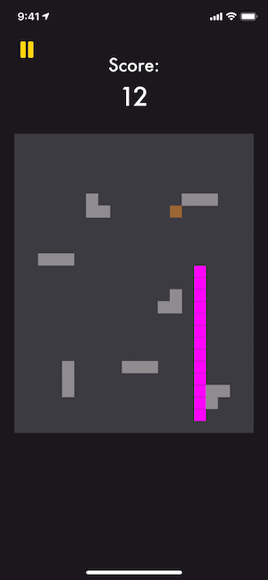
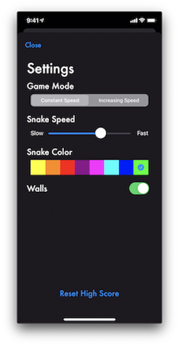

# Snake App
This app is a Snake game clone for iOS. In it the snake has to eat food to grow and score points, it can also travel through walls and dies only when it crashes into itself.

## Features
There are two game modes, one in which the snake moves at a constant speed that the user defines and another where the speed of the snake increases as it grows.

Furthermore, the user can choose to play the game with or without walls. When the user chooses to play with walls, these are placed randomly and change every game. If the snake crashes into a wall, the game is over.

All of this options can be set from the settings screen. The user can also change the color of the snake to one of the given color options and reset its high score.

## Technologies
This app was developed using Xcode 11 and Swift 5.
